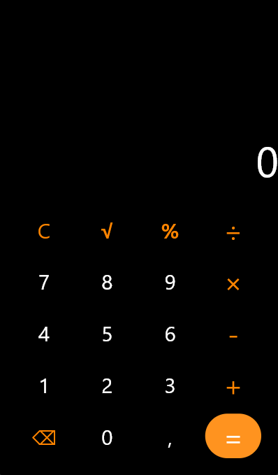

# Calculadora em Flet

Uma calculadora simples e funcional desenvolvida em Python utilizando o framework Flet para interface gráfica. Este projeto demonstra as capacidades básicas do Flet para criar aplicações desktop e web com uma única base de código Python.

## 🚀 Funcionalidades

* **Operações Básicas:** Suporta adição, subtração, multiplicação e divisão.
* **Interface Intuitiva:** Layout limpo e fácil de usar, similar a calculadoras tradicionais.
* **Responsividade:** Adapta-se a diferentes tamanhos de tela (característica do Flet).
* **Limpar e Deletar:** Botões para limpar a entrada (`C`) e para apagar o último caractere (`DEL`).





## 🛠️ Tecnologias Utilizadas

* **Python:** Linguagem de programação principal.
* **Flet:** Framework Python para construir GUIs e aplicações web multiplataforma.

## ⚙️ Como Executar o Projeto

Siga estes passos para ter a calculadora rodando na sua máquina:

### Pré-requisitos

Certifique-se de ter o Python 3.7+ instalado.

### Instalação

1.  **Clone o repositório:**
    ```bash
    git clone [https://github.com/Pozenatos/Calculadora_em_FLET.git](https://github.com/Pozenatos/Calculadora_em_FLET.git)
    cd Calculadora_em_FLET
    ```

2.  **Crie e ative um ambiente virtual (recomendado):**
    ```bash
    python -m venv .venv
    # No Windows:
    .venv\Scripts\activate
    # No macOS/Linux:
    source .venv/bin/activate
    ```

3.  **Instale as dependências:**
    ```bash
    pip install 'flet[all]'
    ```
    

### Execução

1.  **Execute a aplicação:**
    ```bash
    flet run main.py
    ```
    Ou, se preferir rodar diretamente como um script Python:
    ```bash
    python main.py
    ```

    Isso abrirá a calculadora em uma nova janela.

## 🤝 Contribuição

Contribuições são sempre bem-vindas! Se você tiver sugestões, melhorias ou encontrar algum bug, sinta-se à vontade para:

1.  Abrir uma [Issue](https://github.com/Pozenatos/Calculadora_em_FLET/issues).
2.  Criar um [Pull Request](https://github.com/Pozenatos/Calculadora_em_FLET/pulls).

Por favor, siga as boas práticas de desenvolvimento e commit.

## 📄 Licença

Este projeto está licenciado sob a Licença MIT - veja o arquivo [LICENSE](LICENSE) para detalhes.
